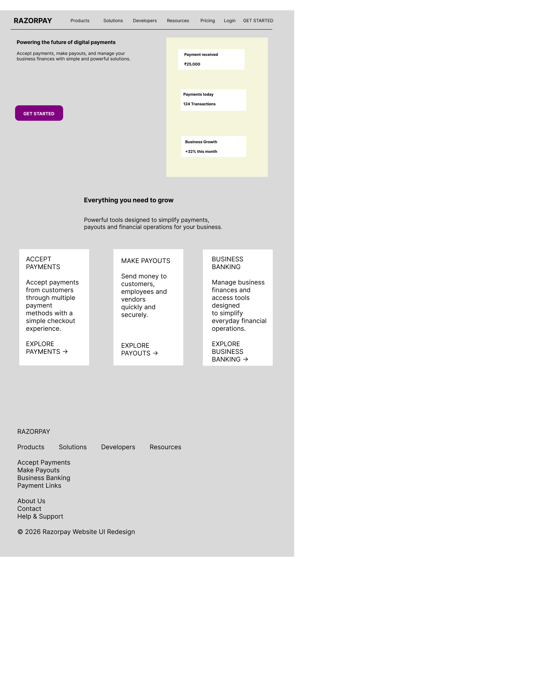
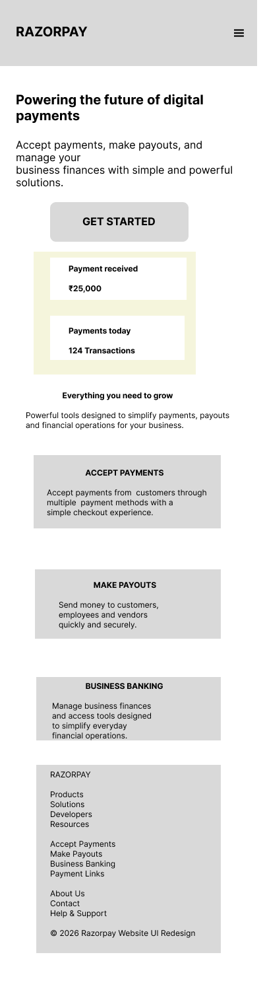

# Razorpay Website UI Redesign

A high-fidelity responsive UI redesign of the Razorpay website created as part of a UI/UX design internship.

## Project Overview

This project focuses on improving the usability, visual hierarchy, consistency, and responsive experience of a financial technology website.

The redesign includes both desktop and mobile layouts.

## Design Process

### 1. Heuristic Evaluation

The existing website was evaluated using usability principles to identify areas for improvement, including:

- Visual hierarchy
- Navigation clarity
- CTA visibility
- Consistency
- Readability
- Content density
- User guidance

### 2. Mood Board

The visual direction focuses on:

- Professional
- Modern
- Trustworthy
- Clean
- Minimal

The design uses a purple, white, and light-grey visual palette.

### 3. Style Guide

The design system includes:

- Inter typography
- Consistent buttons
- Rounded cards
- Standard spacing
- Simple icons
- Clear visual hierarchy
- Responsive design principles

## High-Fidelity Designs

### Desktop Homepage

### Mobile Homepage

## Key Features

- Responsive desktop and mobile layouts
- Clear navigation
- Strong primary CTAs
- Consistent card components
- Improved visual hierarchy
- Clean financial-product aesthetic
- Mobile-friendly stacked layout

## Tools Used

- Figma
- GitHub

## Project Type

UI/UX Design Internship Project

## Disclaimer

This is an independent UI/UX redesign concept created for educational and internship purposes. It is not an official Razorpay website or product.
